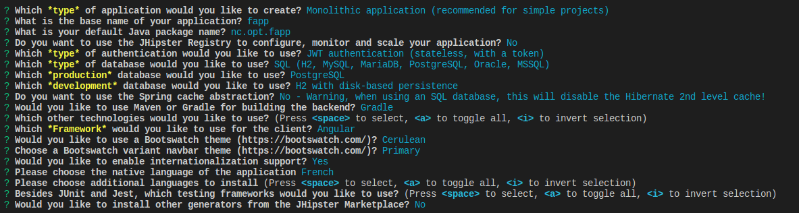
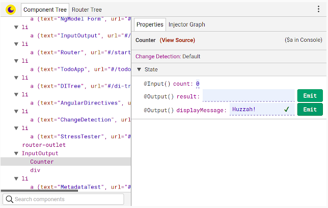
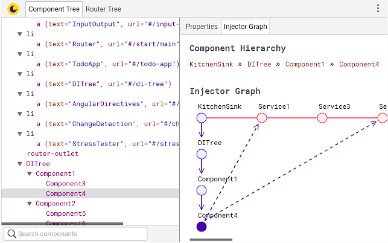
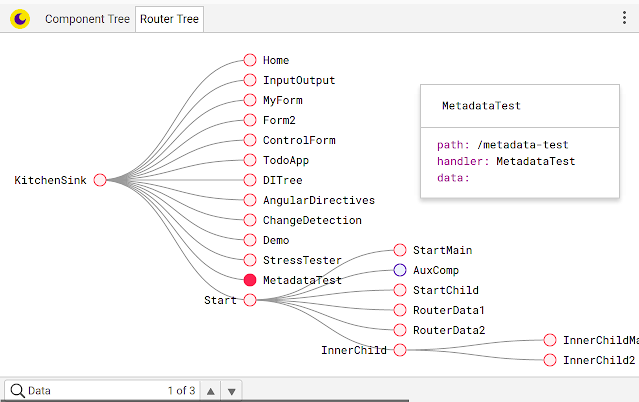

# Configure Linux Elementary OS for development


This project is intended to log software, libraries and frameworks installation on Linux Elementary OS.

## Install Brave Browser

from : [installing-brave#linux](https://brave-browser.readthedocs.io/en/latest/installing-brave.html#linux)

```bash
sudo apt install apt-transport-https curl

curl -s https://brave-browser-apt-release.s3.brave.com/brave-core.asc | sudo apt-key --keyring /etc/apt/trusted.gpg.d/brave-browser-release.gpg add -

source /etc/os-release

echo "deb [arch=amd64] https://brave-browser-apt-release.s3.brave.com/ $UBUNTU_CODENAME main" | sudo tee /etc/apt/sources.list.d/brave-browser-release-${UBUNTU_CODENAME}.list

sudo apt update

sudo apt install brave-browser -y
```

## Install Git

```bash
# Install git
sudo apt install git -y

# configure
git config --global user.name tiamat-azure \
&& git config --global user.email tiamat.azure@gmail.com

# Check versions
git --version

# Configure cache
git config --global credential.helper cache
git config --global credential.helper 'cache --timeout=2600000'
git config --global --list
```

## Add self-signed CA (optional)

```bash
# Copier
sudo cp *.crt /usr/local/share/ca-certificates/

# Vérifier
ls /usr/local/share/ca-certificates/

# Ajouter
sudo update-ca-certificates
```

## Install ZSH

doc: [instaling-zsh](https://github.com/ohmyzsh/ohmyzsh/wiki/Installing-ZSH)

```bash
sudo apt install zsh

# Version check
zsh --version

# Make it your default shell
chsh -s $(which zsh)
```

## Install Oh My Zsh

Install Oh My Zsh

```bash
sh -c "$(curl -fsSL https://raw.githubusercontent.com/ohmyzsh/ohmyzsh/master/tools/install.sh)"
```

Configure some plugins in ~/.zshrc

```bash
plugins=(
 git
 ubuntu
 docker
 docker-compose
 history
)
```

Configure some aliases in ~/.zshrc

```bash
#======================================#
# Aliases
#======================================#

# Reload ~/.bashrc
#alias sourceb="source ~/.bashrc"
alias sourcez="source ~/.zshrc"

# Show my ip address
alias myip="curl http://ipecho.net/plain; echo"

## mkdir && cd
alias mkcd='foo(){ mkdir -p "$1"; cd "$1" }; foo'

## git add all, commit with comments then push function
alias gcp='_gcp(){ git add .; git commit -m "$1"; git push; git status }; _gcp'

## npm
alias nis="npm install --save "

## VS Code
alias coden='code -n .'
alias codel='code --list-extensions'
alias codei='code --install-extension'
alias codeu='code --uninstall-extension'

## get rid of command not found ##
alias cd..='cd ..'

## a quick way to get out of current directory ##
alias ..='cd ..'
alias ...='cd ../../../'
alias ....='cd ../../../../'
alias .....='cd ../../../../'
alias .4='cd ../../../../'
alias .5='cd ../../../../..'

# handy short cuts #
alias c='clear'
alias h='history'
alias hs='history | grep'
alias j='jobs -l'

# Stop after sending count ECHO_REQUEST packets #
alias ping='ping -c 5'
# Do not wait interval 1 second, go fast #
alias fastping='ping -c 100 -s.2'

# APT commands
alias apt="sudo apt"
alias apti="sudo apt install -y"
alias aptu="sudo apt update"
alias aptui="sudo apt update && sudo apt install -y "
alias aptfu="sudo apt full-upgrade -y"
alias aptar="sudo apt auto-remove -y"
alias aptsys="sudo apt-get install unattended-upgrades"
alias aptrepo="sudo add-apt-repository"

# update packages
alias apt-get="sudo apt-get"

# update on one command
alias update='sudo apt-get update && sudo apt-get upgrade && sudo apt-get dist-upgrade && sudo apt auto-remove'
alias updatey='sudo apt-get update --yes && sudo apt-get upgrade --yes && sudo apt-get dist-upgrade --yes && sudo apt auto-remove'
alias updatesys="sudo apt-get install unattended-upgrades"
alias updateall='sudo apt-get update --yes && sudo apt-get upgrade --yes && sudo apt-get dist-upgrade --yes && sudo apt-get install unattended-upgrades && sudo apt auto-remove'

# become root #
alias root='sudo -i'
alias su='sudo -i'

## NGINX
alias nginxreload='sudo /usr/local/nginx/sbin/nginx -s reload'
alias nginxtest='sudo /usr/local/nginx/sbin/nginx -t'

## pass options to free ##
alias meminfo='free -m -l -t'

## get top process eating memory
alias psmem='ps auxf | sort -nr -k 4'
alias psmem10='ps auxf | sort -nr -k 4 | head -10'

## get top process eating cpu ##
alias pscpu='ps auxf | sort -nr -k 3'
alias pscpu10='ps auxf | sort -nr -k 3 | head -10'

## Get server cpu info ##
alias cpuinfo='lscpu'

## set some other defaults ##
alias df='df -hPT | column -t'
alias du='du -ch'

## Date and Time Aliases
alias d='date +"%F"'
alias now='date +"%F %T"'

# GitHub
GH_USER="tiamat-azure"
GH_REPO=""
GH_TOKEN=""

# Prise en compte de l'option -p dans zsh
# setopt multios

# Créer une issue sur GitHub
function issue() {

    # Demander les informations nécessaires à l'utilisateur
    # read -p "Issue title: " title
    echo "Issue title: "
    read title
    body=""

    # Créer l'issue en utilisant l'API GitHub
    number=$(curl -s -X POST -H "Authorization: token $GH_TOKEN" -d "{\"title\":\"$title\",\"body\":\"$body\"}" "https://api.github.com/repos/$GH_USER/$GH_REPO/issues" | jq -r '.number')
    echo "Issue crée #$number"
}
```

## Install VS Code

doc: [how-to-install-visual-studio-code-on-ubuntu-18-04](https://linuxize.com/post/how-to-install-visual-studio-code-on-ubuntu-18-04/)

First, update the packages index and install the dependencies by typing:

```bash
aptui software-properties-common apt-transport-https wget
```

Next, import the Microsoft GPG key using the following wget command:

```bash
wget -q https://packages.microsoft.com/keys/microsoft.asc -O- | sudo apt-key add -
```

And enable the Visual Studio Code repository by typing:

```bash
aptrepo "deb [arch=amd64] https://packages.microsoft.com/repos/vscode stable main"
```

Install the latest version of Visual Studio Code with:

```bash
aptui code
```

Install VS Code extensions

```bash
# Install extensions
    codei shd101wyy.markdown-preview-enhanced \
&&  codei vscjava.vscode-java-pack \
&&  codei pivotal.vscode-boot-dev-pack \
&&  codei davidanson.vscode-markdownlint \
&&  codei formulahendry.docker-extension-pack \
&&  codei deitry.apt-source-list-syntax

# Verify
codel
```

Upgrade actual VSCode installation

```bash
apti --only-upgrade code
```

## Install SDKMAN

```bash
# Install
curl -s "https://get.sdkman.io" | bash

# Apply
source "$HOME/.sdkman/bin/sdkman-init.sh"

# Check version
sdk version
```

## Install JVM

Install jdk 8 (from AdopOpenJDK, Java.net and GraalVM vendors)

```bash
sdk i java 8.0.232.j9-adpt

sdk i java 8.0.232.hs-adpt

sdk i java 8.0.232-open

sdk i java 19.3.0.r11-grl
```

Verify java version

```bash
java -version
javac -version
```

## Install Gradle

```bash
# Check available gradle versions
sdk ls gradle

# Install specific version
sdk i gradle 6.0.1
```

## Install Pinta

```bash
# Add repository
aptrepo ppa:pinta-maintainers/pinta-stable

# Update and Install
aptui pinta
```

## Install Docker

doc: [how-to-install-and-use-docker-on-ubuntu-18-04](https://www.digitalocean.com/community/tutorials/how-to-install-and-use-docker-on-ubuntu-18-04)

```bash
# First, update your existing list of packages:
aptu

# Next, install a few prerequisite packages:
apti apt-transport-https ca-certificates curl software-properties-common

# Then add the GPG key for the official Docker repository to your system:
curl -fsSL https://download.docker.com/linux/ubuntu/gpg | sudo apt-key add -

# Add the Docker repository to APT sources:
aptrepo "deb [arch=amd64] https://download.docker.com/linux/ubuntu bionic stable"

# Next, update the package database with the Docker packages from the newly added repo:
aptu

# Make sure you are about to install from the Docker repo instead of the default Ubuntu repo:
apt-cache policy docker-ce

# Finally, install Docker:
apti docker-ce

# Check that it’s running:
sudo systemctl status docker
sudo docker ps

# Executing the docker command without sudo (optional)
sudo usermod -aG docker ${USER}

# Check
id -nG
```

## Install Docker-Compose

Doc: [docker-compose-install](https://docs.docker.com/compose/install/)

```bash
# Run this command to download the current stable release of Docker Compose:
sudo curl -L "https://github.com/docker/compose/releases/download/1.25.0/docker-compose-$(uname -s)-$(uname -m)" -o /usr/local/bin/docker-compose

# Apply executable permissions to the binary:
sudo chmod +x /usr/local/bin/docker-compose

# Check
docker-compose -v

```

## Install NVM

```bash
# Install nvm
curl -o- https://raw.githubusercontent.com/nvm-sh/nvm/v0.35.1/install.sh | bash

# Check lts versions available
nvm ls-remote --lts | grep Latest

# Install lastest LTS node version
nvm install v12.13.1

# Check
node -v
```

## Install JHipster (with npm)

```bash
# Install latest JHipster generator
npm install -g generator-jhipster

# Install latest Yo generator
npm install -g yo@latest
```

## First JHipster app

```bash
# Create new directory
mkcd first-app

# Launch JHipster CLI
jhipster

# Answer questions
```



```bash
# Build front
npm start

# Build back
./gradlew -x webpack
```

## Tips

- JHipster recommends to use [Angular Augury](https://augury.rangle.io/) for debugging Angular application into the browser.




- How to upgrade VScode to earliest version ?

```bash
# Answer
apti --only-upgrade code
```

## Troubleshooting

- Npm start gets error message : "Error: ENOSPC: System limit for number of file watchers reached"

```bash
# Answer
echo fs.inotify.max_user_watches=524288 | sudo tee -a /etc/sysctl.conf && sudo sysctl -p
```

- By default Jhipster does not install [angular-cli](https://cli.angular.io/). You need to install it manually :

```bash
# Install
npm i -g @angular/cli@8.3.20

# Then use commands
ng help

```
